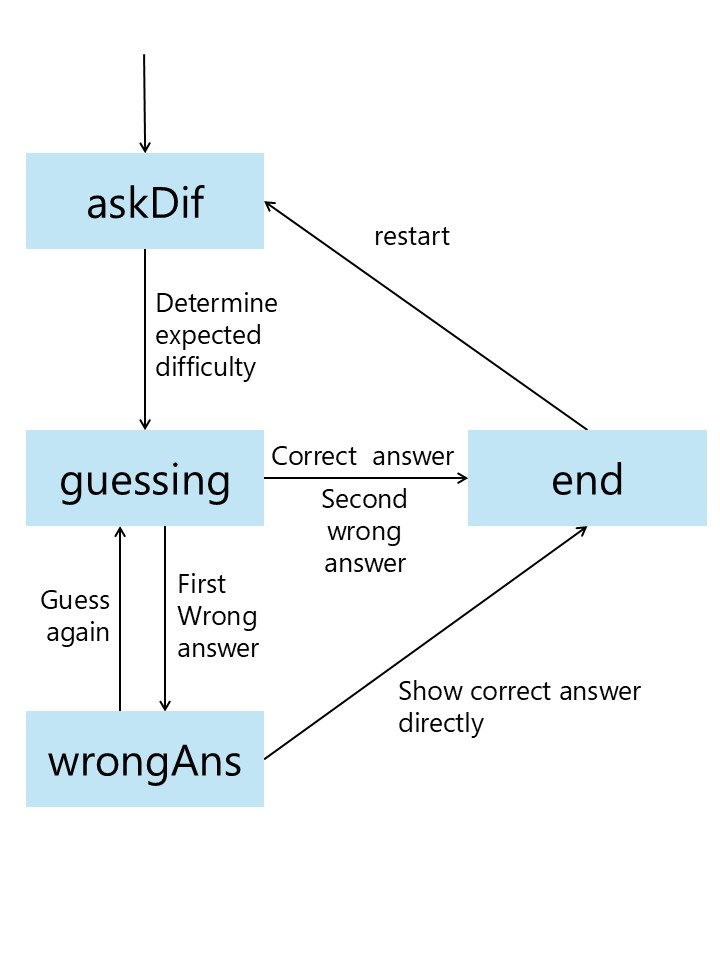

# TOC_final_project
這是一個提供吉卜力電影劇照猜測來源的遊戲

## 遊戲規則
玩家輸入遊戲難度，不同難度的差別在於題目圖片被裁切後可見的大小。

玩由LLM判斷玩家期望難度後，Agent會根據玩家要求的難度出題目並傳送給玩家看。

玩家必須要猜測出圖片出自哪一部吉卜力電影。

若是答對了，這輪遊戲就贏了。

若是答錯了，玩家可以選擇直接公布答案開始下一輪遊戲，或者以原題目降低難度再猜測一次。

注意，只能有一次的重猜機會，若是答對了就贏了這一輪遊戲；若是再次猜錯則遊戲失敗，公布答案結束這輪。

## 安裝
本程式以Python進行，請先安裝Python。

另外，請安裝運行中所需的模組

```bash
pip install pillow requests beautifulsoup4
```

## 如何執行
請執行main.py

另外，API key與API URI寫在call_LLM內，github內附檔案中，這兩欄會留空，請下載後自行編輯輸入

## project結構
```bash
code/
    cache/
    data/
        movieSet.json
    tool/
        getPic.py
        processPic.py
        deleteCache.py
    openPic.py
    call_LLM.py
    agent.py
    main.py
README.md
```
- cache檔會儲存每輪遊戲所需的圖片，遊戲結束會自動刪除
- data中的movieSet儲存了可用來出題的電影集
- tool內包含抓取、裁切圖片與刪除快取檔案的工具
- openPic可使用圖片檢視器自動開啟題目圖片
- call_LLM負責與LLM溝通
- agent負責主要遊戲流程
- main是CLI的入口

## State Machine Diagram

